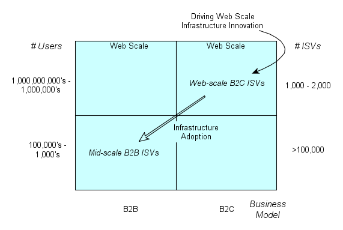

## Web Scale Infrastructure and B2B ISVs

### Summary

Consumer-oriented Web Scale Independent Software Vendors [ISVs] have been driving infrastructure innovations at an accelerating pace. B2B ISVs with smaller user bases may not have been able to justify the creation of new Web-scale infrastucture, but they *can* justify the use of it, though with a different balance of benefits than B2C Web-scale ISVs.  Collateral benefits stemming from Web-scale challenges are applicable to problems faced by B2B ISVs.

### Innovation and Adoption Trends

[Web scale ISVs] [5] have been refining their technology infrastructure for about 20 years now and at this point, some scale to operating millions of servers to deliver their online services. This is part of a [longer term trend] [6] of consumer markets driving tech innovation. Consumer Web Scale [CWS] ISVs have been creative in using a variety of economic models to provide their infrastructure innovations to the wider market as defraying the costs across a wider base than just their business provides a competitive advantage. The rest of the [ISV market] [12] has been figuring out to what extent and in what form they will provide their software as an online service.

Competitive forces are driving businesses to take on more operational cost and risk. Examples include [fullfillment in retailing] [11], [payment models in healthcare] [10] and [ISV SaaS or Cloud models] [13]. These relentless forces require B2B ISVs to rethink their business models and figure out how to transition to the new target models while not undermining their businesses. Part of this consideration is how to make best use of Web scale infrastructure often provided by CWS ISVs.  This includes figuring out which public Cloud services to leverage (or not), but often there are more rudimentary considerations - what do I have to do to move my application to a cloud form - [is it a good fit?] [7]  Assuming the application can be made [cloud ready] [8], another wave of questions about your new target model arises:

* How does my organization need to change?
* What kinds of skills do we need?
* What delineation of responsibilities is needed and how to coordinate between them?
* *How deep to these changes need to be?*

That last question is contextual, i.e. it depends on the situation, but it is the more revealing question. It asks at what level will we need to re-optimize? Will changes be to individuals, teams, groups, or the full organization?  Is the organization's whole mission changing or just some objectives or goals?

### Interdisciplinary Perspective

Accomodating  operational expense and risk on behalf of your customers will  have an impact on the mission.  As the business model is affected, the impact is felt widely - marketing, sales, engineering and services all need adjustments. And those groups may have to work together in unprecedented ways.  A key intersection of groups that could leverage Web-scale infrastructure in the business model transition is that of engineering, QA and operations. This is the arena of [DevOps] [14]. Engineering and QA had already been transforming with agile practices.  DevOps extends that transformation to include operations. Optimally those three groups are able to work together as an interdisciplinary team combining their different expertises to set new goals, establish new metrics and refine new practices.

Large, messy, complex endeavors such as in [healthcare] [15] or [military missions] [3] have used interdisciplinary teams to be able to adapt to changing conditions that overwhelm initial planning. Here is a summary of some guiding principles cited by Randy Cadieux in his insightful article relating DevOps teams and combat flight crews (it's worth a read):

1. Wipe out the zero defect mentality with regard to human performance.
2. Acknowledge the reality that there is a gap between Work-As-Designed and Work-As-Performed.
3. Understand that human error and blaming people for problems doesn’t fix system problems.
4. Don’t base success simply on outcomes because the end doesn't necessarily justify the means.
5. Acknowledge the need for adaptability and adaptive capacity.
6. Break down the authority gradient between ranks or positions for open communications to speed up execution and foster a bias for action.
7. Build a shared understanding of each team member’s work, so that team members can understand the immediate impact of decisions and cascading impacts across the team.

These guidelines do not suggest a set of experts operating independently.  Rather they suggest group of individuals working together under shared values so they can work interdependently in an effective way. The individuals in this group work to have a broader perspective than their own expertise.

### Transitioning

Despite the need for interdisciplinary teamwork in DevOps, there is also a need for clean coordination and clear contracts between the groups. At the packaging level, [containers] [17] such as [Docker] [16] can serve as such a contract between groups. For those unfamiliar, containers can be thought of as a light weight virtual machine that has a much smaller footprint and initiates much faster. The trade-off is that the container cannot host a guest operating system. All containers on a host use the host's operating system. The adoption rate for containers is picking up, Docker in particular.  

Where are we in this transition? Here's a couple of data points:

- [Datadog June 2016 survey] [1]
  - As of June 2016, Docker runs on 10% of the hosts Datadog monitors.
  - Larger companies are leading adoption. This is thought to be due to the larger volume of servers that larger companies will employ.
- [RightScale May 2016 survey] [2.5]
  - Enterprises are using containers more than SMBs. 29 percent of enterprises have workloads running in containers versus 24 percent of SMBs, and 41 percent of enterprises are experimenting as compared to 33 percent of SMBs.
  - Evaluating Docker adoption across different geographies, industries, and roles, RightScale found that current use of Docker is heaviest among tech organizations (32 percent), enterprises (29 percent), and developers (28 percent).
  - For respondents who are not currently using containers, lack of experience was by far the top challenge (39 percent).
  - The top container initiative in 2016 will be getting more educated (62 percent), followed by conducting more experiments with containers in dev/test (44 percent) and production (28 percent), as well as expanding container use in dev/test (28 percent)

Though it is difficult to map these statistics to the B2B ISV population, it would appear that containers are moving from early to mainstream adoption.  And gaining experience with containers is key to further adoption.

And beyond container's themselves is the ability to manage clusters of containers. Container cluster managers are additional Web-scale infrastructure components providing Web-scale out capabilities, but address reliabilty and resiliance issues - both issues germain to B2B ISVs.  One such manager is Kubernetes which has been open sourced by Google.  A summary description from Kubernetes:

[Kubernetes] [9] satisfies a number of common needs of applications running in production, such as:

* co-locating helper processes,
* facilitating composite applications
* preserving the one-application-per-container model,
* mounting storage systems,
* distributing secrets,
* application health checking,
* replicating application instances,
* horizontal auto-scaling,
* naming and discovery,
* load balancing,
* rolling updates,
* resource monitoring,
* log access and ingestion,
* support for introspection and debugging, and
* identity and authorization.

Kubernetes builds on top of containers such as Docker and was designed to address issues that arise most dramatically at Web-scale level deployments - issues such as server and component failure.  At Web-scale, such failures are a daily event.  CWS ISVs had to tackle recovery and resilience issues head on and so built in replication and health-check mechanisms into the cluster management. They also had to deal with large scale new version application rollouts and the need to be able to rollback with no downtime in the event something went wrong.  B2B ISVs would benefit from these capabilities even though they are not operating at Web-scale.

But the price is having members of the DevOps team gain experience with these capabilities.  

There are many excellent "how to" articles on working with containers and cluster managers. But most Dev and Ops practitioners have constraints on the time-slice they can allocate to experimentation.  This is especially true in the Windows environment as many of these tools have a Unix, if not more specifically Linux, orientation.  Ideally a little scaled down lab where the tools are available, live and ready to work together would help enable useful experiments to happen.

[An Overview of Laminar Lab](index.md)

  [1]: https://www.datadoghq.com/docker-adoption/   "Datadog 06/2016 Survey Article"
  [2]: http://www.rightscale.com/blog/cloud-industry-insights/cloud-computing-trends-2016-state-cloud-survey#security  "Cloud Computing Trends: 2016 State of the Cloud Survey"
  [2.5]: http://www.rightscale.com/blog/cloud-industry-insights/new-devops-trends-2016-state-cloud-survey "New DevOps Trends: 2016 State of the Cloud Survey - May 2016"
  [3]: http://www.v-speedsafety.com/blog/2016/9/7/devops-teams-and-combat-flight-crews-an-interdisciplinary-approach-to-learning-and-improvement "DevOps Teams and Combat Flight Crews-An Interdisciplinary Approach to Learning and Improvement"
  [4]: https://pdfs.semanticscholar.org/9fe2/1a478bda61908d3d506fd994ad3ac307618b.pdf "Sources of Failure in the Public Switched Telephone Network"
  [5]: http://expandedramblings.com/index.php/resource-how-many-people-use-the-top-social-media/ "Web Scale Companies"
  [6]: http://www.nytimes.com/2001/06/21/business/technology-computer-gains-driven-by-consumer-products.html "Long trend of consumer driven technology"
  [7]: http://learn.cloudvelox.com/h/i/290603118-selecting-applications-bad-candidates-for-cloud-migration-ten-factors-4 "Bad Candidates for Cloud Migration"
  [8]: https://12factor.net/ "The Twelve-Factor App"
  [9]: https://kubernetes.io/docs/whatisk8s/ "What is Kubernetes?"
  [10]: https://www.acponline.org/about-acp/about-internal-medicine/career-paths/residency-career-counseling/guidance/understanding-capitation "Understanding Capitation"
  [11]: http://www.mwpvl.com/html/internet_retail_distribution_challenges.html "Internet Retailers: Challenges in Order Fullfillment and Distribution Operations"
  [12]: http://www.isvworld.com/ "ISVWorld: The software industry database"
  [13]: http://www.davidchappell.com/writing/white_papers/How_SaaS_Changes_an_ISVs_Business--Chappell_v1.0.pdf "How SaaS Changes and ISVs Business"
  [14]: https://en.wikipedia.org/wiki/DevOps "DevOps"
  [15]: https://www.ncbi.nlm.nih.gov/pmc/articles/PMC3662612/table/T5/ "Characteristics of a good interdisciplinary team"
  [16]: https://www.docker.com/what-docker "What is Docker?"
  [17]: https://en.wikipedia.org/wiki/Operating-system-level_virtualization "Container Virtualization"
