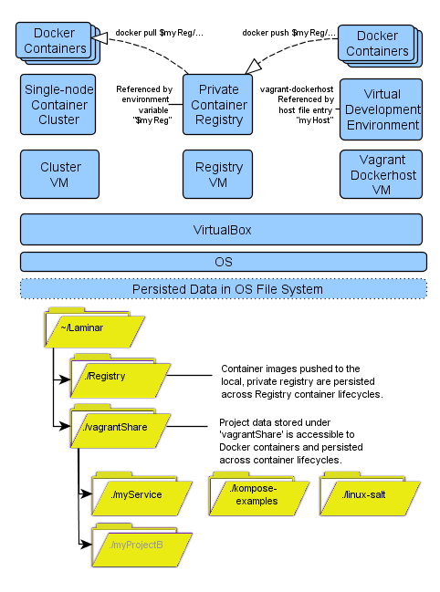
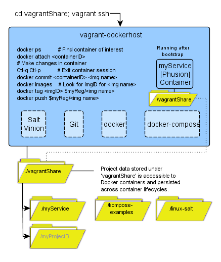

# Overview

* [Intro](#intro-1)
* [Step-by-Step](step-by-step.md)
* [Laminar Commands](laminar-commands.md)
* [Theory of Operations](theory-of-ops.md)
* [More on Why - A Bigger Picture](bigger-picture.md)
* [Attributions](attributions.md)
* [References](references.md)

## Intro

Laminar Lab provides a single machine DevOps lab that incorporates and aligns a tool set to enable Dev or Ops practitioners to exercise software packages in a scaled-down but operationally accurate environment.  The tools used in the lab scale up to production needs and provide production oriented features such as sustaining replica targets and rolling updates and rollback.

The Laminar "bootstrap" command downloads and stands up the component configuration shown below.  The three primary tool families are (left-to-right):

1. Kubernetes - specifically Minikube - supporting a single node cluster and the Kompose Docker Compose migration tool.
2. Docker-machine  running a private container registry but supports any docker-compose container configuration
3. Vagrant running a VM with docker/docker-compose provisioned within and running a Phusion example container.

Docker containers are the primary "contract" in Laminar Lab and access to the local private container registry is pre-configured. An environment variable - "$myReg" - is configured in both the host OS and in the Vagrant VM in support of Docker push and pull commands.  Both the Docker Machine docker engine and the Minikube cluster are also configured to accept $myReg as the local private registry.  

Withing the Laminar directory is a directory called "registry" which provides local, persistent storage for the Registry container.  The Registry container itself can be destroyed and re-created, but the images that have been pushed to the Registry will be persisted in the Laminar registry directory.

Also within the Laminar directory hierarchy, there is a directory called "vagrantShare" which is shared by the host OS and the Vagrant VM (running Ubuntu).  Containers running within the VM can be configured to share access to vagrantShare as well - the Phusion example container has been configured this way.

This "Russian doll" configuration of components, all sharing access to the vagrantShare directory, eases access to project directories residing with vagrantShare from each component level.

Within vagrantShare is the myService directory providing the Phusion based example container which does nothing but provide a bash shell to explore the container. Phusion is a pared down version of Ubuntu that has been optimized for running in Docker containers.

Also within vagrantShare is the kompose examples directory.  The Kompose tool supports converting Docker Compose multi-container applications into Kubernetes applications. Each Kompose example subdirectory holds a "docker-compose.yml" file defining an example application.   Each example can be run either with "docker-compose up" or "kompose up" resulting in the two forms respectively.

The linux-salt directory contains the SaltStack configuration state definitions that set up the Vagrant VM.

## Why Laminar Lab?

There are many excellent "how to" articles on working with the tools assembled by Laminar Lab.  See the references section. But most Dev and Ops practitioners have constraints on the time-slice they can allocate to experimentation.  The point behind Laminar is to allow those not already using these tools to cut down on the time it takes to get to productively trying out meaningful new things.  This is especially true in the Windows environment as many of these tools have a Unix, if not more specifically Linux, orientation.  With Laminar, the time to get setup is reduced to about a minute to clone the Github repository down to your machine, 10 minutes to ensure the BIOS is set for Hardware Virtualization, another minute execute the bootstrap and 20 minutes for the bootstrap to run.  At that point, the tools are available, live and ready to work together.  So Laminar Lab is just a time saver, though one that can make the difference between useful experiments happening or not.

## Getting Started

More usage information for Laminar Lab can be found here:
[Laminar README.MD](https://github.com/trochford/Laminar#laminar-lab)

Follow the "Getting started..." steps in the README overview.
  [Laminar Bootstrap](https://github.com/trochford/Laminar#laminar-bootstrap)

