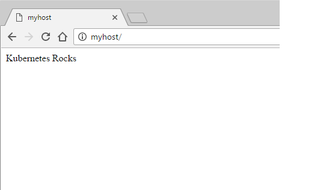
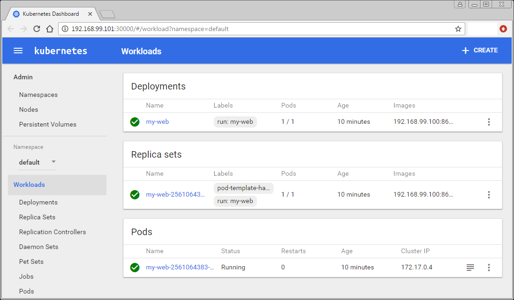
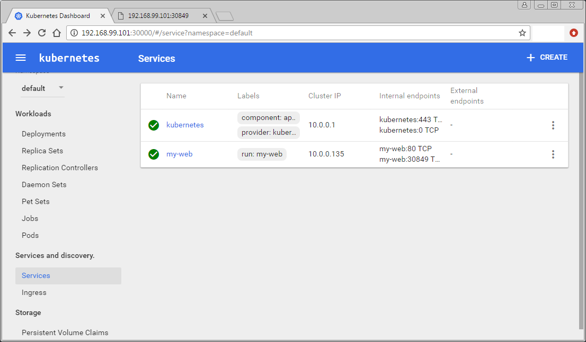
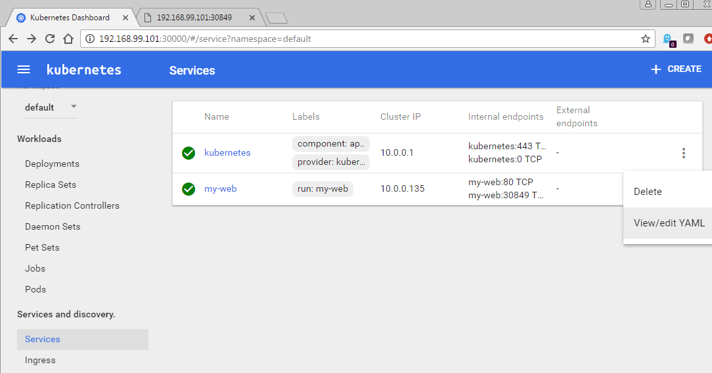
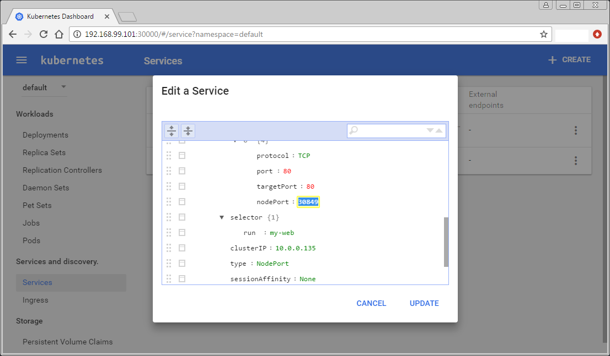

### Quick Baby Steps


### A quick intro with Kubernetes

Here is an article outlining a sequence of steps to learn about Kubernetes.  Many of those steps are automated by Laminar.

[Configuring the Ultimate Development Environment for Kubernetes](http://thenewstack.io/tutorial-configuring-ultimate-development-environment-kubernetes/)

Here is the subset of steps based for the same exercise with Laminar as the base:

```
cd [Laminar dir]/vagrantShare

  PS C:\users\tim\Laminar-master\vagrantShare> vagrant ssh

vagrant ssh

  Welcome to Ubuntu 14.04.5 LTS (GNU/Linux 3.13.0-105-generic x86_64)

   * Documentation:  https://help.ubuntu.com/

    System information as of Sun Jan 29 18:04:41 UTC 2017

    System load:  0.06              Users logged in:        0
    Usage of /:   7.0% of 39.34GB   IP address for eth0:    10.0.2.15
    Memory usage: 10%               IP address for eth1:    172.17.0.3
    Swap usage:   0%                IP address for docker0: 172.18.0.1
    Processes:    95

    Graph this data and manage this system at:
      https://landscape.canonical.com/

    Get cloud support with Ubuntu Advantage Cloud Guest:
      http://www.ubuntu.com/business/services/cloud

  New release '16.04.1 LTS' available.
  Run 'do-release-upgrade' to upgrade to it.


  *** System restart required ***
  Last login: Sun Jan 29 18:04:42 2017 from 10.0.2.2
  vagrant@vagrant-ubuntu-trusty-64:~$

docker pull httpd

  Using default tag: latest
  latest: Pulling from library/httpd
  5040bd298390: Pull complete
  63408554ba61: Pull complete
  4dfe9ef0af52: Pull complete
  84871cd4d3da: Pull complete
  b376204f8aa6: Pull complete
  2a8d452c2c14: Pull complete
  7cfa9c4a8891: Pull complete
  Digest: sha256:1407eb0941b010035f86dfe8b7339c4dd4153e2f7b855ccc67dc0494e9f2756c
  Status: Downloaded newer image for httpd:latest
  vagrant@vagrant-ubuntu-trusty-64:~$

docker run -d --name myweb --hostname myweb -p 80:80  httpd

  70b8869e3a33e6613840e45269038f03499838986d8c9f7ed8f7c748b64c4105
  vagrant@vagrant-ubuntu-trusty-64:~$

docker exec myweb bash -c "echo 'Kubernetes Rocks' > '/usr/local/apache2/htdocs/index.html'"

  vagrant@vagrant-ubuntu-trusty-64:~$

echo $myReg

  192.168.99.100:86
  vagrant@vagrant-ubuntu-trusty-64:~$

docker commit myweb $myReg/myweb

  sha256:a8e4aaac58420d63ae903f8905250217af1ae041d3f461dd21e5c05ba58fff72
  vagrant@vagrant-ubuntu-trusty-64:~$

docker push $myReg/myweb

  The push refers to a repository [192.168.99.100:86/myweb]
  ef1068de39f8: Pushed
  c5e0a28e69a4: Pushed
  b2d948e93d72: Pushed
  9c8479093358: Pushed
  1a54a78be1b4: Pushed
  606932b110bc: Pushed
  8ad975ae00da: Pushed
  a2ae92ffcd29: Pushed
  latest: digest: sha256:d4de589e808d01e9a3ea6b0ade1f30257b9eb7b5c3b98c31634f01ea59c02414 size: 1987
  vagrant@vagrant-ubuntu-trusty-64:~$

docker ps

  CONTAINER ID        IMAGE               COMMAND              CREATED             STATUS              PORTS
    NAMES
  70b8869e3a33        httpd               "httpd-foreground"   7 minutes ago       Up 7 minutes        0.0.0.0:80->80/tcp
    myweb
  cd7dfe2fc58d        c0aa867f9a31        "/bin/bash"          16 minutes ago      Up 10 minutes
    Phusion
  vagrant@vagrant-ubuntu-trusty-64:~$

exit

  logout
  Connection to 127.0.0.1 closed.
  PS C:\users\tim\Laminar-master\vagrantShare>

# Bring up a browser and hit "http://myhost:80"

```



```
minikube docker-env

  $Env:DOCKER_TLS_VERIFY = "1"
  $Env:DOCKER_HOST = "tcp://192.168.99.101:2376"
  $Env:DOCKER_CERT_PATH = "C:\Users\Tim\.minikube\certs"
  $Env:DOCKER_API_VERSION = "1.23"
  # Run this command to configure your shell:
  # & minikube docker-env | Invoke-Expression
  PS C:\users\tim\Laminar-master\vagrantShare>

& minikube docker-env | Invoke-Expression

  PS C:\users\tim\Laminar-master\vagrantShare>

echo $myReg

  192.168.99.100:86
  PS C:\users\tim\Laminar-master\vagrantShare>

docker pull $myReg/myweb

  Using default tag: latest
  latest: Pulling from myweb
  e12c678537ae: Pull complete
  efc629aa862f: Pull complete
  798b93590488: Pull complete
  81330e0e59fd: Pull complete
  797cc803e420: Pull complete
  d6a37ec24efa: Pull complete
  319fcc46069e: Pull complete
  cf947717221c: Pull complete
  Digest: sha256:d4de589e808d01e9a3ea6b0ade1f30257b9eb7b5c3b98c31634f01ea59c02414
  Status: Downloaded newer image for 192.168.99.100:86/myweb:latest
  PS C:\users\tim\Laminar-master\vagrantShare>

kubectl run my-web --image=$myReg/myweb --port=80

 deployment "my-web" created
 PS C:\users\tim\Laminar-master\vagrantShare>

kubectl expose deployment my-web --target-port=80 --type=NodePort

  service "my-web" exposed
  PS C:\users\tim\Laminar-master\vagrantShare>

kubectl get svc my-web

  NAME      CLUSTER-IP   EXTERNAL-IP   PORT(S)   AGE
  my-web    10.0.0.135   <nodes>       80/TCP    1m
  PS C:\users\tim\Laminar-master\vagrantShare>

minikube ip

  192.168.99.101
  PS C:\users\tim\Laminar-master\vagrantShare>

minikube dashboard
```



```
Scroll down and click on Services (left panel).
```



```
Click on Actions and choose View/edit yaml (right panel).
```



```
Scroll down to find the NodePort for the my-web Service.
```




```
Hit the IP from minikube ip at the nodeport port in a browser.
```


```
This shows the index.html changed under Vagrant and saved in the registry,
now pulled from the registry into Kubernetes and running.
The my-web container is viewable in the Minikube Dashboard
and accessible in a browser from Kubernetes.

```


[Back to Overview](index.md)
